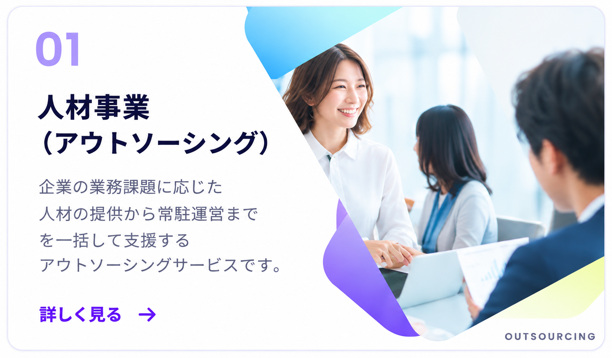

# ELEVATE サイト初期構成

添付のサイトマップに合わせた19ページの静的HTML・CSS・JavaScriptの初期セットです。ビルドは不要です。TOPのインタビューには同梱のSwiperを使用します。本文・画像・フォームの送信処理は未実装です。

## 共通ファイル

ご指定の「commn」に統一しています（「common」表記のディレクトリは作成していません）。

- `commn/css/common.css`：リセット、色・幅の変数、共通ヘッダー／フッター、レスポンシブ対応。
- `commn/js/common.js`：共通処理（フッターの年を更新）。
- `commn/template.html`：新規ページ用HTMLテンプレート。
- `commn/template.css` / `commn/template.js`：新規ページ用CSS・JSテンプレート。

各HTMLに日本語設定・文字コード・viewport・タイトル・description・共通ヘッダー／フッター・本文領域・CSS／JS読み込みを配置しています。ヘッダー／フッターはHTML内に直接配置しているため、変更時は各ページとテンプレートに反映してください。

## URL・ファイル一覧

| ページ | URL | HTML |
| --- | --- | --- |
| TOP | `/` | `index.html` |
| サービス内容 | `/service/` | `service/index.html` |
| 総合人材派遣サービス | `/service/staffing/` | `service/staffing/index.html` |
| 人材派遣 | `/service/staffing/staffing-agency/` | `service/staffing/staffing-agency/index.html` |
| 業務請負 | `/service/staffing/contract-work/` | `service/staffing/contract-work/index.html` |
| 人材紹介 | `/service/staffing/recruitment-agency/` | `service/staffing/recruitment-agency/index.html` |
| システムエンジニアリングサービス | `/service/engineering/` | `service/engineering/index.html` |
| AI導入サービス AI-LINK | `/service/engineering/ai-link-merged.html` | `service/engineering/ai-link-merged.html` |
| お仕事紹介をご希望の方 | `/introduction/` | `introduction/index.html` |
| 総合人材派遣サービス | `/introduction/staffing/` | `introduction/staffing/index.html` |
| フリーランスエンジニア ELEVATE | `/lp/` | `lp/index.html` |
| よくあるご質問 | `/introduction/faq/` | `introduction/faq/index.html` |
| 登録スタッフの方 | `/registered/` | `registered/index.html` |
| 前払い申請フォーム | `/advance-payment/` | `advance-payment/index.html` |
| 交通費申請フォーム | `/transportation-expenses/` | `transportation-expenses/index.html` |
| かんたんWeb登録 | `/web-registered/` | `web-registered/index.html` |
| 企業向けお問い合わせ | `/contact/` | `contact/index.html` |
| 会社概要 | `/company/` | `company/index.html` |
| プライバシーポリシー | `/privacy/` | `privacy/index.html` |

## ディレクトリと命名

各ページのディレクトリに `index.html`、`css/style.css`、`js/script.js` を配置しています。TOP専用ファイルはルート直下の `css/style.css` と `js/script.js` です。

AI-LINKのみ添付のURLを優先し、`service/engineering/ai-link-merged.html`、`service/engineering/css/ai-link-merged.css`、`service/engineering/js/ai-link-merged.js` としています。

前払い申請・交通費申請・LPはサイトマップのURLどおりルート直下です。メニュー上の親子関係とURLのディレクトリ階層は必ずしも一致しません。

## 確認方法

`index.html` をブラウザで開くとTOPのページ一覧から全ページに移動できます。リンクはローカルで直接開ける相対パスです。

添付の `/service/` のようなURLでも確認する場合は、このフォルダで次を実行します（Python 3が必要です）。

```sh
python3 -m http.server 8000
```

ブラウザで `http://localhost:8000/` を開きます。終了は `Ctrl+C` です。

## 編集・追加方法

1. 本文を各HTMLの `<main>` 内に追加し、タイトルとdescriptionを更新します。
2. 全ページ共通のデザインは `commn/css/common.css`、個別のデザインは各ページのCSSに記述します。
3. 共通処理は `commn/js/common.js`、個別の処理は各ページのJSに記述します。
4. ページ追加時は `commn/template.html` をコピーし、CSS・JSテンプレートもページ用ディレクトリにコピーします。
5. テンプレートの相対パス（共通CSS・JS、ナビゲーション、個別CSS・JS）を階層に合わせて修正します。

フォームページも現時点では初期HTMLのみです。公開前に各ページの内容、正式な会社情報、入力項目・バリデーション・送信先を実装してください。

## 共通ホバーアニメーション

`commn/css/common.css` で管理します。各ページで以下のクラスを付けて使います。

```html
<!-- 画像だけを0.3秒で少し薄くする（子孫のimgが対象） -->
<a class="hover-image" href="service/index.html">
  
</a>

<!-- テキストの下線を0.3秒で左から伸ばす -->
<a class="hover-underline" href="company/index.html">会社情報</a>
```

画像単体には `` と指定できます。
時間は `--hover-duration`（初期値 `0.3s`）、画像の透明度は `--hover-image-opacity`（初期値 `0.75`）で調整できます。
キーボードのフォーカス時にも適用します。タッチ操作ではホバーを適用せず、動きを減らす設定ではアニメーションを省略します。

ヘッダー・フッターのボタンや文字ロゴには `hover-fade` を使用します。
矢印を除き文字だけに下線を付ける場合は、リンクに `hover-trigger`、文字を囲む `span` に `hover-underline` を付けます。

## スクロール・カードの動き

- `data-reveal`：画面に入ったとき、一度だけ下からフェードインします。複数要素は少しずつ時間をずらします。
- `hover-lift`：ホバー・キーボードフォーカス時に4px浮き上がります。
- 共通ヘッダーは `position: sticky` で上部に固定し、スクロールすると影を表示します。アンカーリンクの位置は実際のヘッダー高に合わせて調整します。

処理は `commn/js/common.js`、スタイルは `commn/css/common.css` で管理します。動きを減らす設定では登場アニメーションを省略します。JavaScript無効時も本文は表示されます。

## 社員インタビュー

Swiper 12.1.4（MIT）を `commn/vendor/swiper/` に同梱しています。
公式ガイド：https://swiperjs.com/get-started

`index.html` の `.swiper-wrapper` 内に `.swiper-slide` とカードを追加します。
カードの `data-interview` は1からの連番とし、`js/script.js` の `stories` に対応する3つの回答を追加してください。
画像・タイトル・職種はカードからモーダルに反映されます。4・5枚目は既存画像を再利用した仮カードで、全モーダルの本文はサンプルです。

PCは3枚、タブレットは2枚、スマートフォンは約1枚を表示します。矢印・ページネーション・スワイプで操作できます。
モーダルは閉じるボタン、背景クリック、Escキーで閉じ、元のカードにフォーカスを戻します。

NEWSは遷移しないテキスト表示です。ページトップボタンはFV下端が固定ヘッダーの下に入ると右下に表示されます。SCROLLアイコンはホバー・フォーカス時に下へ6px動きます。

## TOPのオープニング

`css/loading.css` と `js/loading.js` で管理します。同じタブで最初にTOPを開いたときだけ約6秒再生します。`sessionStorage` に記録し、再読み込み・他ページからの再訪・SKIP後は省略します。
「人の力と技術力。」「働く未来を創造する。」→粒子の飛散→「働くその先へ」→本文の順で表示します。
Canvasの文字ピクセルを粒子の座標に変換しています。文言は `first` と `last`、タイミングは `draw` 内で変更できます。
SKIP・Escで終了できます。動きを減らす設定では省略し、JavaScript無効時も本文を表示します。描画エラーや8秒経過時にも終了します。

## セクションの装飾背景

`section-art` を付けると共通の淡い背景を表示します。`section-art--reverse` を追加すると左右反転と表示位置・濃度を変更できます。TOPではサービスと社員インタビューに使用し、NEWSとお仕事紹介は白背景です。
画像は `images/common/section-background.png`、スタイルは `commn/css/common.css` で管理します。上下を白へなじませ、スマートフォンではさらに薄く表示します。濃度は `--section-art-opacity` で調整できます。

TOPの背景は現在、bodyの `page-art` クラスでページ全体に固定配置しています。各セクションの `section-art` は外し、共通の一枚を見せています。濃度は `--page-art-opacity`（PC: 0.65、スマートフォン: 0.45）で変更できます。FVのメインビジュアル・ヘッダー・フッターは既存の背景を重ねて表示します。

SP（767px以下）のページ共通背景は `images/common/section-background-sp.png` に切り替わります。

HERO内のサイズは `--hero-unit` で画面幅に比例します。PCは1366px・SPは375pxを基準とし、高さ・文字・ボタン・余白を同じ比率で変更します。SPは縦並びと画像の縦横比から高さが決まります。

## SPメニュー

767px以下では本文と同じ淡い背景画像・ネイビー文字の全画面メニューを表示します。リンクの順次表示、Web登録・お問い合わせ導線、背景のスクロール停止とinert化、Tabキーのフォーカス循環、Escで閉じる操作に対応します。横向きなど高さが足りない画面ではメニュー内をスクロールできます。768px以上へ広げた際は閉じて通常ナビゲーションへ戻します。

ホバー演出は768px以上かつマウス等でホバー可能な端末に限定しています。SPではメニュー開閉・登場演出とキーボードのフォーカス表示を維持します。

## 浮遊する背景画像

TOPの `.floating-background` 内に6枚の装飾画像を配置しています。`commn/css/common.css` の各 `nth-child` で位置・サイズ・濃度・移動距離・周期を変更できます。17〜26秒の異なる周期で緩やかに浮遊します。SPは小さく薄くし、動きを減らす設定では静止します。メニュー・モーダル・ローディング中は一時停止します。画像は `images/common/floating-orb-01.png` 〜 `06.png` です。
